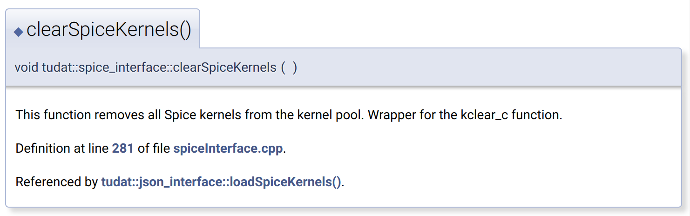

.. post:: 2021-05-06
   :tags: devops
   :author: Geoffrey

Maintaining API Documentation
==============================

Putting it lightly, the ``tudat`` source has a "difficult to maintain" system
for code docstrings. This is a problem, because these docstrings are needed in
order to generate the most used component related to software: API
Documentation. Let's take an arbitrary example.

.. code-block:: C++
    :caption: ``tudat/include/interface/spice/spiceInterface.h`` (`permalink`_)

    //! Computes the angular velocity of one frame w.r.t. to another frame.
    /*!
     * Computes the angular velocity of one frame w.r.t. to another frame. at a given
     * time instant. kernels defining the two frames, as well as any required intermediate frames, at
     * the requested time must have been loaded. Wrapper for xf2rav_c spice function (utilizing
     *  sxform_c).
     * \param originalFrame Reference frame from which the rotation is made.
     * \param newFrame Reference frame to which the rotation is made.
     * \param ephemerisTime Value of ephemeris time at which rotation is to be determined.
     * \return Angular velocity of newFrame w.r.t. originalFrame, expressed in originalFrame.
     */
    Eigen::Vector3d getAngularVelocityVectorOfFrameInOriginalFrame(const std::string &originalFrame,
                                                                   const std::string &newFrame,
                                                                   const double ephemerisTime);

.. _`permalink`: https://github.com/tudat-team/tudat/blob/fa30c49dca7ee27630717efb8546802589a4c8b7/include/tudat/interface/spice/spiceInterface.h#L175

This is setup up correctly to allow `Doxygen`_ to generate the following entry
in the C++ API documentation:

.. _`Doxygen`: https://www.doxygen.nl/index.html

This can then be translated into Sphinx documentation using `Breathe`_,
allowing both a Doxygen and Sphinx-based API, for whichever users are more
comfortable with. However, the process of translating this into Python
docstrings to enable the Python API to be generated is usually manual.

.. _`Breathe`: https://breathe.readthedocs.io/en/latest/

1. Extract docstring(s) from headers.
2. Translate into a Python docstring style understood by established tools.
3. Translate types from C++ to Python equivalent types:

+---------------------+--------------------+
| C++                 | Python             |
+---------------------+--------------------+
| ``double``          | ``float``          |
+---------------------+--------------------+
| ``std:vec<X>``      | ``list[Y]``        |
+---------------------+--------------------+
| ``std::pair<A,B>``  | ``tuple[C,D]``     |
+---------------------+--------------------+
| ``Eigen::Vector3d`` | ``np.ndarray[,3]`` |
+---------------------+--------------------+

4. Change references to other functions in the API, to Python equivalent forms.

Following this process, we have developed the required function for the
``pybind11`` solution:

.. code-block:: C++

    std::string get_get_angular_velocity_vector_of_frame_in_original_frame_docstring(){
        return R"mydelimiter(
            Computes the angular velocity of one frame w.r.t. to another frame.

            Extended Summary
            ----------------
            Computes the angular velocity of one frame w.r.t. to another frame. at a given
            time instant. kernels defining the two frames, as well as any required intermediate frames, at
            the requested time must have been loaded. Wrapper for xf2rav_c spice function (utilizing
            ``sxform_c``).

            Parameters
            ----------
            original_frame : str
                Reference frame from which the rotation is made.
            new_frame : str
                Reference frame to which the rotation is made.
            ephemeris_time : float
                Value of ephemeris time at which rotation is to be determined.

            Returns
            -------
            angular_velocity : np.ndarray[,3]
                Angular velocity of newFrame w.r.t. originalFrame, expressed in originalFrame.
        }

Factor in the reality that the ``tudat`` API is currently in constant flux,
features are constantly being added when required by thesis students, and the
developers working on the source code are continuously changing, we arrive in
an unsustainable situation. The one question is why is there no existing
solution to this? Short answer, based on anecdotal evidence, either it's not
required as code bases usually are less dynamic or it's because they have a
much smaller collection of functions and classes to maintain documentation for
(e.g. PaGMO). We need consistency, maintainability and accessibility summarised
by the following requirements:

.. _requirement:

1. The API documentation shall originate from a single data source.
2. The API documentation shall be human readable (so as to allow any
   non-developer ability to contribute).
3. The API documentation shall provide mechanisms for language-specific content
   for a given API element.

Enter ``multidoc``:

``multidoc``
------------

In short, ``multidoc`` is a tool that generates docstrings for API's that exist
in multiple languages. The starting point is an API declaration:

.. code-block::
    :caption: ``API declaration``

    tudat-api-declaration/
    ├── __api__.yaml
    ├── interface
    │   ├── __module__.yaml
    │   └── spice.yaml
    └── simulation
        ├── __module__.yaml
        └── environment_setup.yaml

The API declaration is a directory containing information that generalises a
language agnostic API structure. This effect of this structure affects the
source of both C++ and `pybind11` exposures differently. There are some
benefits already gained by defining the API structure independent from the
source:

1. The API can designed before touching source code. Developers can come to
   an agreement on details before coding.
2. The API documentation can be maintained independent from the source. This
   means that API documentation is more accessible.

``__api__.yaml``
----------------

The following file is the top level API declaration. It defines higher level
documentation and structure of the highest level.

.. code-block:: yaml
    :caption: ``__api__.yaml``

    package:
      name: tudat-cpp    # [cpp]
      name: tudatpy      # [py]

    description: "{{ api.package.name }} is an awesome project!"

    modules:
      - interface
      - simulation

    functions:
      - name: get_answer_of_universe
        short_summary: Returns the answer to everything
        returns:
            - name: answer_of_universe
              type: int # [cpp]   <-- this is unnecessary, but for the sake of demo
              type: int # [py]    <-- ^
              description: "The only real answer to anything: 42"

There are a few things to notice here, firstly the ``# [XXX]`` tags. These
take part in a preprocessing step in the yaml, inspired from ``conda-forge``'s
feedstock tool ``conda-smithy``. This partly fulfils `requirement`_ 3, as it
allows for language specific content. What about if a function refers to one
that it uses internally, from the API itself? This will be dealt with in a
similar way to the ``description`` key:

.. code-block::

    description: "{{ api.package.name }} is an awesome project!"

For ``tudatpy``, this would resolve to "tudatpy is an awesome project!",
during the template replacement step using ``jinja2``, and similarly for
``tudat-cpp``.

What about if a function refers to one that it uses internally, from the API
itself? We would want Python users to be directed to the Python API, rather
than the C++ API. The solution follows similarly from the previous example:

.. code-block::

    description: |
        See ``{{ api.module.submodule.function }}`` for more information!

Module definitions would have the same mechanisms and design as above, with the
exception that the ``package`` key is not present.

.. code-block::

    modules:
      - interface
      - simulation

The final design to note is:

.. code-block::

    ── interface
       ├── __module__.yaml
       └── spice.yaml

``__module__.yaml`` is the module definition for ``interface``, and ``spice.yaml``
is the definition for the ``spice`` submodule. There are effectively two
ways to define a module, as a directory containing ``__module__.yaml`` or as a
standalone ``module.yaml``. The directory version infers the presents of a
submodule contained with the module and the standalone file version infers
that there are no further submodules.

Finally, an example of the generated Python docstring:

.. code-block::

    Returns the answer to everything

    Returns
    -------
    answer_of_universe : int
        The only real answer to anything: 42

This styling follows the `numpydoc`_ formatting.

.. _`numpydoc`: https://numpydoc.readthedocs.io/en/latest/format.html